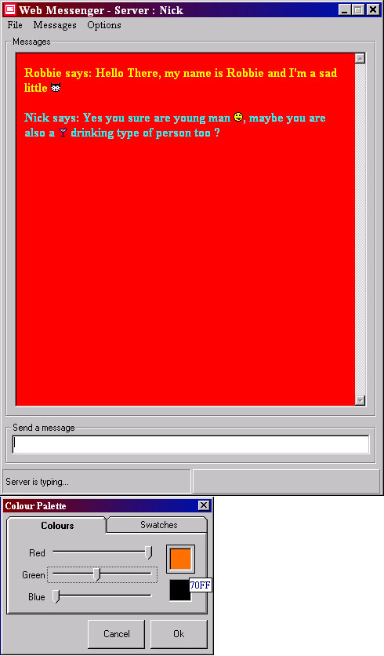



## WEB MESSENGER 2

### Description

For those of you who have never downloaded Web Messenger then to sum it up, it's an MSN Messenger clone. It replaces certain strings for pictures, lets you know when the other person is typing and also lets you change the sounds for each event and the colours for the messages.

For those of you who have downloaded Web Messenger before, the latest upgrade replaces the "Robbie Saunders coding standards" colour palette for an Adobe Photoshop style Active X colour palette. The OCX is included in this zip.

Please try and rate me. If you think its good or bad, please vote me either way.

Thanks again :)

P.S. If your looking for a program with PLENTY of coding examples, then this is the one, it includes Object Orientated Programming, Win Sock control, API calls, Active X user controls and many many more.
 
### More Info
 

             |
---                |---
**Submitted On**   |2001-02-15 19:43:44
**By**             |[Niknak\!\! \<OLD\>](https://github.com/Planet-Source-Code/PSCIndex/blob/master/ByAuthor/niknak-old.md)
**Level**          |Advanced
**User Rating**    |5.0 (40 globes from 8 users)
**Compatibility**  |VB 6\.0
**Category**       |[Complete Applications](https://github.com/Planet-Source-Code/PSCIndex/blob/master/ByCategory/complete-applications__1-27.md)
**World**          |[Visual Basic](https://github.com/Planet-Source-Code/PSCIndex/blob/master/ByWorld/visual-basic.md)
**Archive File**   |[CODE\_UPLOAD150122152001\.zip](https://github.com/Planet-Source-Code/niknak-old-web-messenger-2__1-21036/archive/master.zip)

